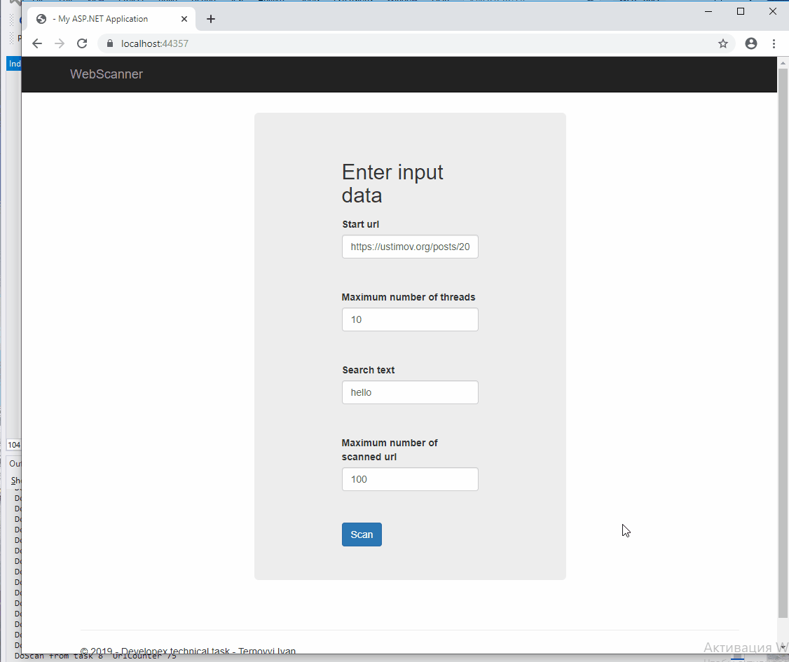

<h1>WebScanner</h1>
<b>Developex techinal task</b>

Using ASP.NET MVC 5 - Entity Framework 6 - TPL

<b>A simple multithreading web application that:</b>
 * Loads web page              
 * Searches text
 * Searches other links
 * Searches text and links in other loaded web pages using multithreading
 * Shows it in scanning monitor

<b>Application architecture:</b>
 * WebScanner.BLL - business logic layer
 * WebScanner.DAL - data access layer
 * WebScanner.MVC - mvc web application

You can see how it works below

